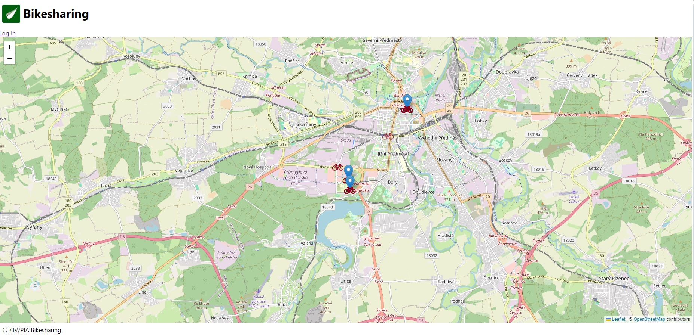

# PIA Semestral Project - Bike Sharing
This readme serves as description how to run this project and brief summary of its capabilities.
Entire description of assignment can be found here
[https://github.com/fidransky/kiv-pia-labs/wiki/Semester-project](https://github.com/fidransky/kiv-pia-labs/wiki/Semester-project)

## Screenshots of the application

This is the home page of this application. Non authorized users can see here locations of all stands and bikes.
Stands are clickable, but you will be asked to log in, since that functionality is only for registered users. You can also
log in with link above the map.


This is the page with login form. Email must be unique within the system. You have option to login via Auth0 provided
by Okta Auth0 service through the link _Log Vie 0Auth2_. At the start of the application there are no users in database,
so you have to first create a new one through the link _Register New User_


This is page with registration form. After successful registration you are taken back to log in page where
you have to log in before being authorized.


This page is shown to authorized user that clicked on certain stand. On the page there are bikes that belongs to this specific
stand and are rideable. Through the button _Ride this Bike_ user is taken to another page. You can also se here, that authorized
users get acces to _See Ride History_ page, where all the Rides made by logged-in user are shown.


After clicking on _Ride this Bike_ user is taken here, where the ride can be started and when he reaches another stand within 50
meters, the ride can be also ended.


This is the page accesible with link _See Ride History_. It shows all Rides made by logged-in user.


Last page here is page designed for user with role *SERVICEMAN* . This user is able to see link _Bikes To Repair_ and through this link
he can go here and mark specific bikes as repaired.

## Running the application
Application is meant to be run with docker with _docker compose up_ command
```
docker-compose up
```
Default page is than accesible on localhost on port 8080: 
[http://localhost:8080/](http://localhost:8080/)

### Technologies used
- `MySQL` for database
- `Java Spring` applications main language
- `Thymeleaf, Javascript` for frontend. Mainly generated through thymeleaf engine.

## API documentation

|       API Path       |   Parameters   | Method | Returns                                                                              |
|:--------------------:|:--------------:|:------:|:-------------------------------------------------------------------------------------|
|          /           |      none      |  GET   | html code of the main page with map, stands and bikes                                |
|     /loginNormal     |      none      |  GET   | html code with login form                                                            |
|      /register       |      none      |  GET   | html code with register form                                                         |
|    /register/save    | {RegisterForm} |  POST  | html code of main page with map, stands and bikes                                    |
|   /bikes/{standId}   |  {String id}   |  GET   | html code with all bikes that belong to stand with id given by Path variable standId |
|       /repair        |      none      |  GET   | html code with all bikes that are due for repair                                     |
|   /repair/{bikeId}   |  {String id}   |  POST  | repairs a bike and return all bikes that are due for repair                          |
|  /history/{userId}   |  {String id}   |  GET   | html code with all Rides performed by user with id given by Path Variable userId     |
| /bikes/ride/{bikeId} |  {String id}   |  GET   | html code with a page for creating and ending a ride.                                |


